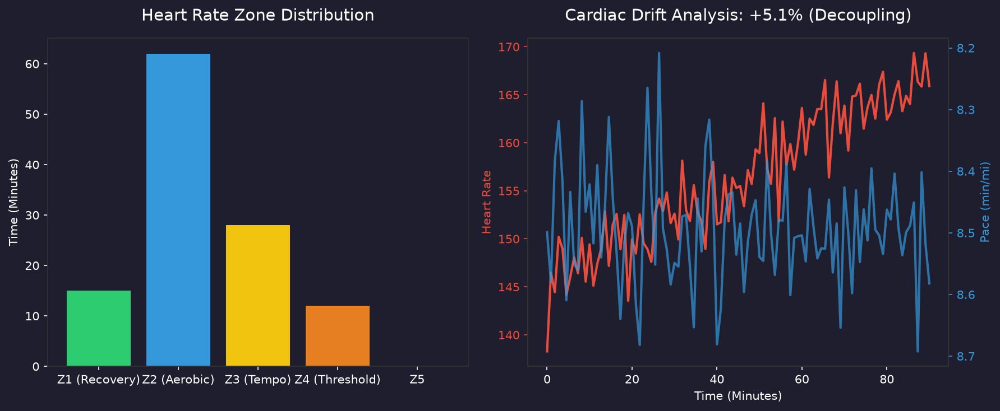

# 🏃 Local Strava MCP Server

[](https://www.python.org/downloads/)
[](https://pandas.pydata.org/)
[](https://modelcontextprotocol.io/)
[](https://opensource.org/licenses/MIT)

Turn Claude (or any MCP-compatible AI) into your personal running and cycling coach. 



*Example of Claude using Pandas to analyze a marathon's Cardiac Drift.*

While most Strava integrations just fetch a basic list of your recent workouts, this server is built from the ground up for **Deep Analytics**. Powered by Python and `pandas`, it gives your AI agent the ability to analyze your heart rate zones (for running, cycling, and swimming), track your shoe mileage, detect your macro-training phases (Build vs. Taper), and even identify mid-run fatigue.

## 🛑️ Why no OAuth or Webhooks? (The Local Advantage)

This server is intentionally designed as a **Local Edge-Compute MCP**. Unlike other Strava MCPs that force you to deploy a Cloudflare Worker and route your private health data through a third-party server, this runs entirely on your own machine. By keeping it local and using a simple `.env` file, we eliminate cloud hosting complexity, ensure your data never leaves your device, and allow the server to directly leverage Python's powerful `pandas` library (which cannot run on V8 isolates like Cloudflare).

## ✨ Why use this one?

- **Multi-Sport, Python & Pandas Native:** Written in Python using `fastmcp`. It's incredibly easy to fork and extend if you want to pipe your running/cycling data into custom data science models or generate `matplotlib` graphs.
- **Deep Time-Series Streams:** Instead of just average pace, it exposes raw, second-by-second heart rate and altitude arrays so Claude can analyze exactly when you peaked on a hill.
- **Smart Filtering:** Your AI doesn't have to read 200 activities to find your last marathon. It can search and slice your history by date, distance, or keyword.
- **Ambient Agent Ready:** Includes tools specifically designed for always-on background agents (like OpenClaw) to summarize your daily training load and weekly goals without blowing up token limits.
- **Auto-Refreshing Auth:** Set it and forget it. It manages Strava OAuth token refreshing seamlessly in the background.

## 🛠️ The Tools

| Tool | Description | Example Query |
|------|-------------|---------------|
| `search_activities` | Filter and slice activities by date, type, distance, or keywords. | *"Find all my runs over 15 miles from last year."* |
| `analyze_activity_zones_pandas` | Pandas-powered breakdown of time-in-zones, cardiac drift (fatigue), and rolling pace/HR. | *"Calculate the Cardiac Drift on my last long run."* |
| `get_training_trends` | Analyzes 12 weeks of data to detect Build, Maintain, or Recovery phases. | *"Am I in a Build phase or a Taper phase right now?"* |
| `get_daily_briefing` | A quick summary of yesterday's workouts and current weekly progress (Run, Ride, etc). | *"Check my Strava and give me a daily training briefing."* |
| `get_starred_segments` | View your starred Strava segments. | *"What segments do I have starred?"* |
| `explore_segments` | Find new segments to ride or run in a specific map area. | *"Find some climbing segments near my location."* |
| `get_athlete_routes` | Pull your saved maps and routes. | *"Show me my saved Strava routes."* |
| `get_recent_activities` | Quick overview of recent workouts (distance, pace, HR). | *"How did my last 5 workouts look?"* |
| `get_activity_details` | Deep dive on a specific activity, including mile splits. | *"Show me the mile splits for my most recent race."* |
| `get_activity_streams` | Raw time-series data (downsampled to save LLM tokens). | *"What was my heart rate graph like on that hill?"* |
| `get_gear_stats` | Shoe mileage tracker to proactively warn you when it's time for new shoes. | *"Do I need to buy new running shoes yet?"* |
| `get_athlete_stats` | All-time and recent totals. | *"What is my all-time running mileage?"* |

## 🚀 Getting Started

### 1. Get your Strava API Credentials
1. Go to your [Strava API Settings](https://www.strava.com/settings/api).
2. Create an application. Set the **Authorization Callback Domain** to `localhost`.
3. Note your **Client ID** and **Client Secret**.

### 2. Generate a Refresh Token
Since this is a local edge-compute MCP, you need to generate your own refresh token once. The server will handle auto-refreshing it from then on.
1. Paste this URL into your browser (replace `YOUR_CLIENT_ID` with your actual ID):
   ```text
   https://www.strava.com/oauth/authorize?client_id=YOUR_CLIENT_ID&response_type=code&redirect_uri=http://localhost&scope=read_all,activity:read_all,profile:read_all
   ```
2. Click "Authorize". You will be redirected to a broken `localhost` page. This is completely normal!
3. Look at the URL bar and copy the `code=...` value.
4. Exchange that code for a refresh token by running this in your terminal:
   ```bash
   curl -X POST https://www.strava.com/oauth/token \
     -d client_id=YOUR_CLIENT_ID \
     -d client_secret=YOUR_CLIENT_SECRET \
     -d code=THE_CODE_YOU_COPIED \
     -d grant_type=authorization_code
   ```
5. Copy the `refresh_token` from the JSON response.

### 3. Installation
   
```bash
git clone https://github.com/JoshTerAvest/local-strava-mcp.git
cd local-strava-mcp

# Create your .env file and paste your credentials
echo "STRAVA_CLIENT_ID=your_id" > .env
echo "STRAVA_CLIENT_SECRET=your_secret" >> .env
echo "STRAVA_REFRESH_TOKEN=your_token" >> .env

# Install dependencies
uv sync
```

### 4. Connect to Claude Desktop
The easiest way to install is using the Claude CLI:
```bash
claude mcp add strava -- uv run server.py
```

Alternatively, manually add it to your `claude_desktop_config.json`:
```json
{
  "mcpServers": {
    "strava": {
      "command": "uv",
      "args": [
        "run",
        "/absolute/path/to/local-strava-mcp/server.py"
      ]
    }
  }
}
```